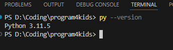

# 第一章：编程初体验

## 1.1 什么是编程？为什么学习编程？

### 什么是编程？
编程就像是给电脑写指令的魔法书！🧙‍♂️

想象一下，电脑是一个非常听话的机器人🤖，但是它只会做你告诉它的事情。编程就是用一种特殊的语言（编程语言）来告诉电脑：
- 做什么事情
- 什么时候做
- 怎么做

### 为什么小朋友要学习编程？
1. **培养逻辑思维** 💡 - 就像解数学题一样有趣
2. **激发创造力** 🎨 - 可以创造自己的游戏和故事
3. **解决问题能力** 🔍 - 学会把大问题分解成小步骤
4. **未来技能** 🚀 - 编程是21世纪的重要技能

## 1.2 Python环境安装和配置

### 第一步：下载Python
1. 打开浏览器，访问：https://www.python.org/downloads/
2. 点击黄色的"Download Python"按钮
3. 选择最新版本（比如Python 3.10或3.11）

### 第二步：安装Python
1. 双击下载的安装文件
2. **重要**：一定要勾选"Add Python to PATH" ✅
3. 点击"Install Now"
4. 等待安装完成

### 第三步：验证安装
1. 打开"命令提示符"（Windows键 + R，输入cmd）
2. 输入：`py --version`
   
3. 如果显示Python版本号，说明安装成功！🎉
   > 注意，不同的版本和环境，其命令不尽相同，有的版本需要使用`python`或者`python3`。

## 1.3 第一个Python程序：Hello World

### 方法一：使用Python Shell（推荐初学者）
1. 在开始菜单搜索"Python"
2. 打开"Python 3.x"（IDLE）
3. 你会看到一个叫做"Python Shell"的窗口
4. 输入：`print("Hello, World!")`
5. 按回车键，你会看到：
   ```
   Hello, World!
   ```

### 方法二：使用文本编辑器
1. 打开记事本
2. 输入：`print("Hello, World!")`
3. 保存为`hello.py`（注意后缀是.py）
4. 在命令提示符中进入文件所在目录
5. 输入：`python hello.py`

### 代码解释：
- `print()` 是一个函数，用来在屏幕上显示文字
- 引号 `""` 里面的内容就是要显示的文字
- 括号 `()` 表示这是一个函数调用

## 1.4 使用IDLE编辑器

### IDLE是什么？
IDLE是Python自带的编辑器，就像是一个专门写Python代码的本子📓

### 如何打开IDLE？
1. 在开始菜单搜索"IDLE"
2. 选择"IDLE (Python 3.x)"

### IDLE的两个窗口：
1. **Shell窗口** 🐚 - 可以立即执行代码，看到结果
2. **编辑器窗口** 📝 - 可以写更长的程序（File → New File）

### 常用快捷键：
- `F5` - 运行程序
- `Ctrl+S` - 保存文件
- `Tab`键 - 自动缩进（Python很重要！）

## 1.5 小练习

### 练习1：打招呼
```python
print("你好，我是Python！")
print("我很高兴认识你！")
```

### 练习2：数学计算
```python
print("2 + 3 =", 2 + 3)
print("10 - 5 =", 10 - 5)
print("4 * 6 =", 4 * 6)
print("20 / 4 =", 20 / 4)
```

### 练习3：创意输出
```python
print("🌟" * 10)
print("   欢迎来到编程世界！")
print("🌟" * 10)
```

## 1.6 本章小结

🎯 **学到了什么？**
- 编程就是给电脑写指令
- 安装了Python开发环境
- 写出了第一个程序"Hello World"
- 学会了使用IDLE编辑器

🚀 **下一步准备**
在下一章，我们将学习变量和数据类型，让程序能够记住信息！

---
💡 **小贴士**：多练习！编程就像学骑自行车，练习越多就越熟练！